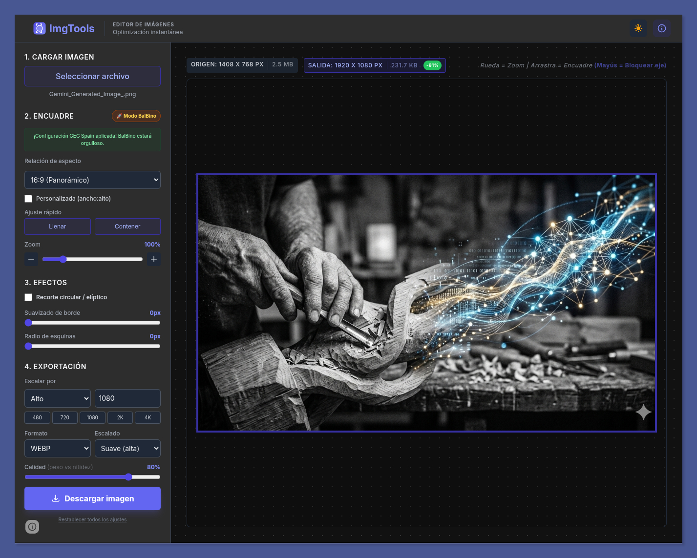

# ImgTools 📸 🚀

> La herramienta definitiva para conseguir que **BalBino** deje de dar la paliza 😘 con las cabeceras del blog de **GEG Spain**.

## 🎯 ¿Por qué existe ImgTools?

Si eres parte del equipo de coordinación de **GEG Spain**, conoces el ritual. BalBino, con todo el amor del mundo y su infinita paciencia manteniendo nuestra web en [transformacioneducativa.es](https://transformacioneducativa.es), nos ha impuesto un flujo de trabajo digno de las doce pruebas de Hércules:

1.  Abrir una presentación de Google configurada a 1920x1080.
2.  Subir tu imagen, ajustarla a la diapo, rezar para que el encuadre sea 16:9.
3.  Descargar la diapo como imagen.
4.  Pasar por herramientas externas para que el archivo no pese más que nuestra conciencia.
5.  Subir a WordPress.

**¡Basta!** ImgTools nace como una "protesta-broma" cariñosa para automatizar este proceso. Queremos mucho a BalBino, pero queremos más nuestro tiempo. Con esta herramienta, lo que antes llevaba 5 minutos ahora se hace en 5 segundos.

## 🚀 El mítico "Modo BalBino"

La joya de la corona. Un botón dorado que, al ser pulsado, configura mágicamente:
*   Relación de aspecto **16:9** perfecta.
*   Resolución de salida a **1080p** (el estándar de las cabeceras).
*   Formato **WebP** con optimización al **80%**.
*   Escalado de alta calidad.

**Resultado:** Una imagen lista para WordPress, ligera, nítida y, lo más importante, **BalBino-approved**.

## ✨ Características principales

*   **Encuadre flexible:** Soporte para ratios 1:1, 4:3, 16:9, 21:9 y dimensiones personalizadas.
*   **Zoom y pan de precisión:** Control total con la rueda del ratón o arrastrando la imagen. Incluye **bloqueo de ejes** (tecla Mayús) para desplazamientos milimétricos.
*   **Efectos avanzados:**
    *   **Recorte circular/elíptico:** Máscaras geométricas perfectas para avatares o creatividades.
    *   **Suavizado perimetral (Feather):** Desenfoque de bordes que sigue la silueta de la imagen (rectangular o curva).
    *   **Radio de esquinas:** Redondeo profesional ajustable.
*   **Ajuste fino numérico:** Haz clic en cualquier valor para introducir los píxeles exactos mediante el teclado.
*   **Límites inteligentes:** Los límites de los efectos escalan proporcionalmente a la resolución de la imagen de la salida.
*   **Motor de exportación:** Escala por ancho, alto o lado largo. Control total sobre el método de suavizado (bicúbico o píxel-art).
*   **Compresión y peso:** Cálculo del tamaño en disco y del porcentaje de ahorro en tiempo real tras cada descarga.
*   **Flujo de trabajo optimizado:** Los ajustes se mantienen al cargar nuevas imágenes para facilitar el procesamiento por lotes.
*   **Modo oscuro:** Sincronizado automáticamente con tu sistema operativo.

## 🛠️ Instalación y uso

ImgTools es una **Single Page Application (SPA)** autocontenida y 100% privada (todo el proceso ocurre en tu navegador local). Tienes dos formas de usarla:

1.  **En línea:** Accede directamente a la herramienta en **[imgtools.pablofelip.online](https://imgtools.pablofelip.online)**.
2.  **Local:** Descarga el archivo `index.html` de este repositorio y ábrelo en cualquier navegador moderno. No necesita instalación ni dependencias.

## 🤝 Contribuciones

Si quieres añadir más modos (¿un "Modo Instagram"?, ¿un "Modo LinkedIn"?), las pull requests son más que bienvenidas. Eso sí, el **Modo BalBino** es sagrado y no se toca.

## ✍️ Autoría y agradecimientos

*   Creado con 💙 por [Pablo Felip Monferrer](https://www.linkedin.com/in/pfelipm/).
*   Inspirado por la incansable (y muy a menudo agotadora) labor de **BalBino** manteniendo la web de [GEG Spain](https://transformacioneducativa.es/).
*   Distribuido bajo la licencia **GNU AGPL v3**.
