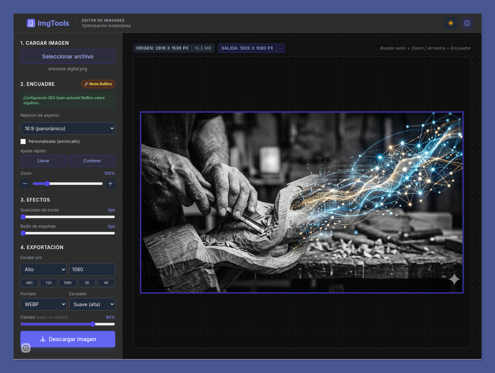

# ImgTools 📸 🚀

> La herramienta definitiva para conseguir que **BalBino** deje de dar la paliza 😘 con las cabeceras del blog de **GEG Spain**.

## 🎯 ¿Por qué existe ImgTools?

Si eres parte del equipo de coordinación de **GEG Spain**, conoces el ritual. BalBino, con todo el amor del mundo y su infinita paciencia manteniendo nuestra web en WordPress, nos ha impuesto un flujo de trabajo digno de las doce pruebas de Hércules:

1.  Abrir una presentación de Google configurada a 1920x1080.
2.  Subir tu imagen, ajustarla a la diapo, rezar para que el encuadre sea 16:9.
3.  Descargar la diapo como imagen.
4.  Pasar por [TinyPNG](https://tinypng.com/) para que el archivo no pese más que nuestra conciencia.
5.  Subir a WordPress.

**¡Basta!** ImgTools nace como una "protesta-broma" cariñosa para automatizar este proceso. Queremos mucho a BalBino, pero queremos más nuestro tiempo. Con esta herramienta, lo que antes llevaba 5 minutos ahora se hace en 5 segundos.

## 🚀 El mítico "Modo BalBino"

La joya de la corona. Un botón dorado que, al ser pulsado, configura mágicamente:
*   Relación de aspecto **16:9** perfecta.
*   Resolución de salida a **1080p** (el estándar de las cabeceras).
*   Formato **WebP** con optimización al **80%**.
*   Escalado de alta calidad.

**Resultado:** Una imagen lista para WordPress, ligera, nítida y, lo más importante, **BalBino-approved**.

## ✨ Características principales

*   **Encuadre flexible:** Soporte para ratios 1:1, 4:3, 16:9, 21:9 y dimensiones personalizadas.
*   **Zoom y pan:** Control total con la rueda del ratón o arrastrando la imagen.
*   **Efectos pro:** Suavizado de bordes (viñeta) y radio de esquinas para avatares perfectos.
*   **Motor de exportación:** Escala por ancho, alto o lado largo a resoluciones desde 480p hasta 4K.
*   **Compresión local:** Todo se procesa en tu navegador. Ni tus fotos suben a un servidor, ni necesitas herramientas externas para reducir el peso.
*   **Modo oscuro:** Sincronizado con tu sistema, porque sabemos que editas cabeceras a las 2 de la mañana.

## 🛠️ Instalación y uso

Esto es una **Single Page Application (SPA)** autocontenida. No necesitas instalar nada, ni configurar bases de datos, ni pelearte con dependencias de Node.js.

1.  Clona este repositorio o descarga el archivo `index.html`.
2.  Ábrelo en cualquier navegador moderno.
3.  ¡Empieza a optimizar!

## 🤝 Contribuciones

Si quieres añadir más modos (¿un "Modo Instagram"?, ¿un "Modo LinkedIn"?), las pull requests son más que bienvenidas. Eso sí, el **Modo BalBino** es sagrado y no se toca.

## ✍️ Autoría y agradecimientos

*   Creado con cariño por **[Pablo Felip Monferrer](https://www.linkedin.com/in/pfelipm/)**.
*   Inspirado por la incansable (y a veces agotadora) labor de **BalBino** manteniendo la web de [GEG Spain](https://transformacioneducativa.es/).
*   Distribuido bajo la licencia **GNU AGPL v3**.
