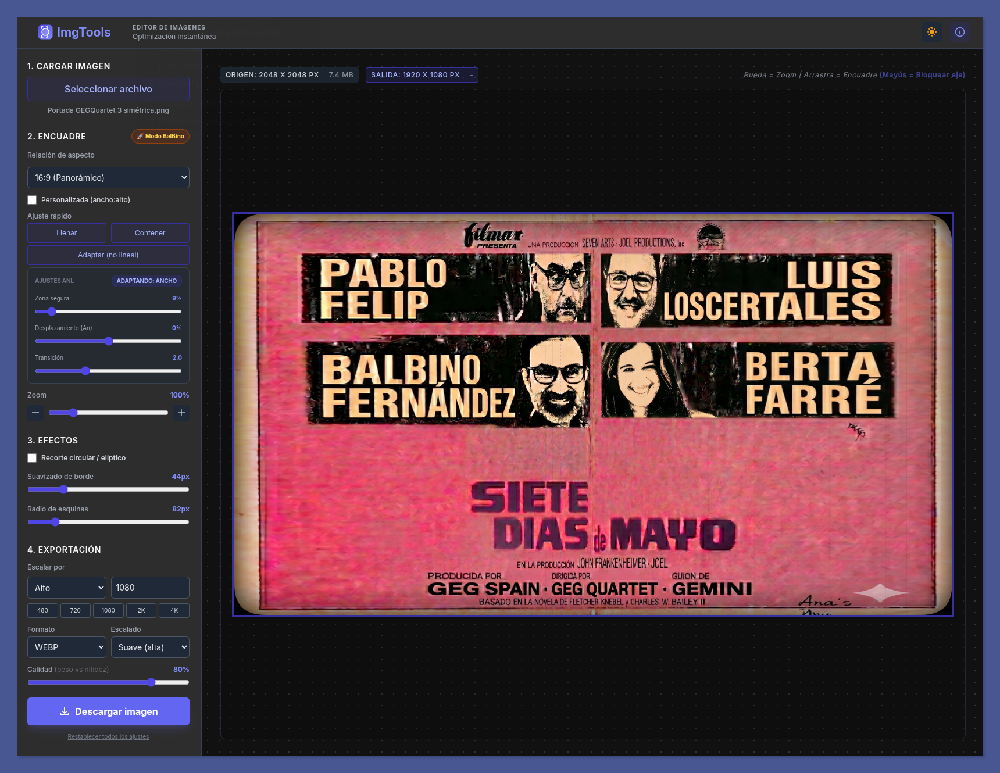

# ImgTools 📸 🚀

> La herramienta definitiva para conseguir que **BalBino** deje de dar la paliza 😘 con las cabeceras del blog de **GEG Spain**.

  

## 🎯 ¿Por qué existe ImgTools?

Si eres parte del equipo de coordinación de **GEG Spain**, conoces el ritual. BalBino, con todo el amor del mundo y su infinita paciencia manteniendo nuestra web en [transformacioneducativa.es](https://transformacioneducativa.es), nos ha impuesto un flujo de trabajo digno de las doce pruebas de Hércules:

1.  Abrir una presentación de Google configurada a 1920x1080.
2.  Subir tu imagen, ajustarla a la diapo, rezar para que el encuadre sea 16:9.
3.  Descargar la diapo como imagen.
4.  Pasar por herramientas externas para que el archivo no pese más que nuestra conciencia.
5.  Subir a WordPress.

**¡Basta!** ImgTools nace como una "protesta-broma" cariñosa para automatizar este proceso. Queremos mucho a BalBino, pero queremos más nuestro tiempo. Con esta herramienta, lo que antes llevaba 5 minutos ahora se hace en 5 segundos.

## 🚀 El mítico "Modo BalBino"

La joya de la corona. Un botón dorado que, al ser pulsado, configura mágicamente:
*   Relación de aspecto **16:9** perfecta.
*   Resolución de salida a **1080p** (el estándar de las cabeceras).
*   Formato **WebP** con optimización al **80%**.
*   Escalado de alta calidad.

**Resultado:** Una imagen lista para WordPress, ligera, nítida y, lo más importante, **BalBino-approved**.

## 🧠 Adaptación No Lineal (ANL)

Esta innovadora función permite cambiar la relación de aspecto de una imagen (por ejemplo, de 1:1 a 16:9) sin necesidad de recortar el contenido ni sufrir las consecuencias de un estiramiento uniforme (que achata o alarga a las personas).

  
   
  🎬 <strong><a href="https://raw.githubusercontent.com/pfelipm/imgtools/main/assets/ajuste-inteligente.mp4" target="_blank">Ver vídeo de demostración del algoritmo ANL</a></strong>

**¿Cómo funciona internamente?**
El motor de ImgTools divide la imagen en **60 rebanadas (slices)**. El algoritmo calcula automáticamente qué eje debe adaptarse y aplica una función de escala no lineal:
*   **Zona segura:** El área central (ajustable de 0 a 100%) que mantiene su proporción original intacta.
*   **Desplazamiento (Bias):** Si el sujeto no está centrado, puedes mover la zona segura para proteger el área de interés.
*   **Transición (Power):** Controla la "curvatura" del estiramiento. Valores altos concentran la distorsión solo en los bordes extremos, dejando casi toda la imagen con apariencia natural.

## ✨ Características principales

### 1. Encuadre y ANL
*   **Ratios preestablecidos:** 1:1, 4:3, 16:9, 21:9 y dimensiones personalizadas.
*   **Zoom y pan de precisión:** Control total con la rueda del ratón o arrastrando la imagen.
*   **Bloqueo de ejes:** Mantén presionada la tecla **Mayús** para desplazar la imagen solo en horizontal o vertical.
*   **Adaptación Inteligente:** El botón **Adaptar (no lineal)** rellena el lienzo automáticamente protegiendo el sujeto.

  

### 2. Efectos y Calidad
*   **Recorte circular/elíptico:** Máscaras geométricas perfectas para avatares.
*   **Suavizado perimetral (Feather):** Desenfoque de bordes que sigue la silueta de la imagen.
*   **Radio de esquinas:** Redondeo profesional ajustable.
*   **Límites inteligentes:** Los límites de los efectos escalan proporcionalmente a la resolución de salida.

  

### 3. Exportación y Rendimiento
*   **Motor de escalado:** Control total sobre el método de suavizado (bicúbico o píxel-art).
*   **Información en tiempo real:** Compara el tamaño del archivo original con el de salida y visualiza el ahorro de espacio.
*   **Ajuste fino numérico:** Haz clic en cualquier valor para introducir los píxeles exactos mediante el teclado.

  

## 🛠️ Instalación y uso

ImgTools es una **Single Page Application (SPA)** autocontenida y 100% privada (todo el proceso ocurre en tu navegador local). Tienes dos formas de usarla:

1.  **En línea:** Accede directamente a la herramienta en **[imgtools.pablofelip.online](https://imgtools.pablofelip.online)**.
2.  **Local:** Descarga el archivo `index.html` de este repositorio y ábrelo en cualquier navegador moderno. No necesita instalación ni dependencias.

## 🤝 Contribuciones

Si quieres añadir más modos (¿un "Modo Instagram"?, ¿un "Modo LinkedIn"?), las pull requests son más que bienvenidas. Eso sí, el **Modo BalBino** es sagrado y no se toca.

## ✍️ Autoría y agradecimientos

*   Creado con 💙 por [Pablo Felip Monferrer](https://www.linkedin.com/in/pfelipm/).
*   Inspirado por la incansable (y muy a menudo agotadora) labor de **BalBino** manteniendo la web de [GEG Spain](https://transformacioneducativa.es/).
*   Distribuido bajo la licencia **GNU AGPL v3**.
