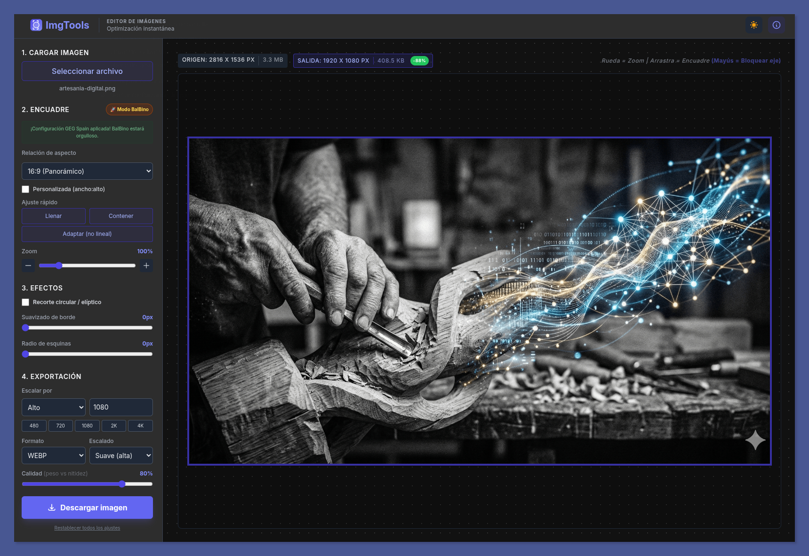
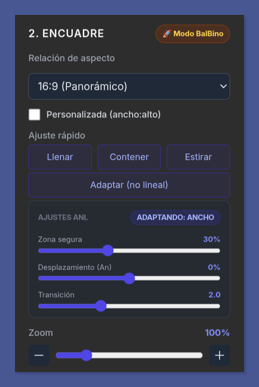
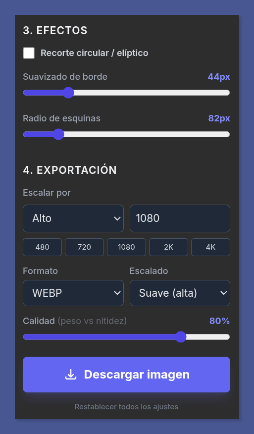
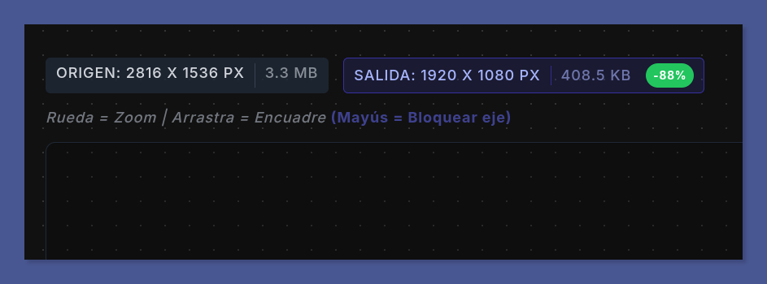

# ImgTools 📸 🚀

> La herramienta definitiva para conseguir que **BalBino** deje de dar la paliza 😘 con las cabeceras del blog de **GEG Spain**.

  

## 🎯 ¿Por qué existe ImgTools?

Si eres parte del equipo de coordinación de **GEG Spain**, conoces el ritual. BalBino, con todo el amor del mundo y su infinita paciencia manteniendo nuestra web en [transformacioneducativa.es](https://transformacioneducativa.es), nos ha impuesto un flujo de trabajo digno de las doce pruebas de Hércules:

1.  Abrir una presentación de Google configurada a 1920x1080.
2.  Subir tu imagen, ajustarla a la diapo, rezar para que el encuadre sea 16:9.
3.  Descargar la diapo como imagen.
4.  Pasar por herramientas externas para que el archivo no pese más que nuestra conciencia.
5.  Subir a WordPress.

**¡Basta!** ImgTools nace como una "protesta-broma" cariñosa para automatizar este proceso. Queremos mucho a BalBino, pero queremos más nuestro tiempo. Con esta herramienta, lo que antes llevaba 5 minutos ahora se hace en 5 segundos.

## 🚀 El mítico "modo BalBino"

La joya de la corona. Un botón dorado que, al ser pulsado, configura mágicamente:
*   Relación de aspecto **16:9** perfecta.
*   Resolución de salida a **1080p** (el estándar de las cabeceras).
*   Formato **WebP** con optimización al **80%**.
*   Escalado de alta calidad.

**Resultado:** Una imagen lista para WordPress, ligera, nítida y, lo más importante, **BalBino-approved**.

## ✨ Características principales

### 1. Encuadre y adaptación inteligente

ImgTools ofrece un control total sobre cómo se sitúa la imagen en el lienzo final:

*   **Ratios preestablecidos:** 1:1, 4:3, 16:9, 21:9 y dimensiones personalizadas.
*   **Zoom y pan de precisión:** Control total con la rueda del ratón o arrastrando la imagen.
*   **Bloqueo de ejes:** Mantén presionada la tecla **Mayús** para desplazar la imagen solo en horizontal o vertical.
*   **Ajustes rápidos:**
    *   **Llenar:** Escala la imagen hasta cubrir todo el lienzo (recorta el exceso).
    *   **Contener:** Ajusta la imagen para que se vea completa (deja bandas negras).
    *   **Estirar:** Realiza un estiramiento lineal uniforme para ocupar todo el espacio.
    *   **Adaptar (no lineal):** La función estrella para redimensionar sin deformar el contenido esencial.

  

#### 🧠 Los secretos de la adaptación no lineal (ANL)

Esta función permite cambiar la relación de aspecto (por ejemplo, de una foto cuadrada a una panorámica 16:9) protegiendo al sujeto principal.

  
   
  <em>Demostración del algoritmo de adaptación no lineal en acción.</em>

**Funcionamiento interno:**
El motor de ImgTools divide la imagen en **60 rebanadas (slices)**. En lugar de aplicar un estiramiento uniforme, el algoritmo utiliza una función de potencia para distribuir la distorsión de manera desigual:
*   **Zona segura:** Define un área central (hasta el 80%) que mantiene su proporción original de 1:1. Es ideal para proteger rostros o logotipos.
*   **Desplazamiento (bias):** Permite descentrar la zona segura si el elemento importante de la foto no está en medio.
*   **Transición (power):** Controla la agresividad de la curva de estiramiento. Un valor alto hace que la distorsión sea casi imperceptible en la mayor parte de la imagen, concentrándola solo en los bordes extremos.

Para facilitar el ajuste, ImgTools muestra **guías visuales de alta visibilidad** (verde neón sobre fondo negro) mientras mueves los deslizadores, desapareciendo automáticamente al soltarlos.

### 2. Efectos y calidad

*   **Recorte circular o elíptico:** Máscaras geométricas perfectas para avatares o creatividades.
*   **Suavizado perimetral (feather):** Desenfoque de bordes que sigue la silueta de la imagen (rectangular o curva).
*   **Radio de esquinas:** Redondeo profesional ajustable con precisión de píxel.
*   **Límites inteligentes:** Todos los efectos escalan sus límites de forma proporcional a la resolución de salida, garantizando resultados consistentes en cualquier tamaño.

  

### 3. Exportación y rendimiento

*   **Motor de escalado:** Control total sobre el método de suavizado (bicúbico de alta calidad o píxel-art).
*   **Información en tiempo real:** Compara el peso del archivo original con el de salida y visualiza el porcentaje de ahorro.
*   **Ajuste fino numérico:** Haz clic en cualquier etiqueta de valor para introducir los datos exactos mediante el teclado.

  

## 🛠️ Instalación y uso

ImgTools es una **Single Page Application (SPA)** autocontenida y 100% privada (todo el proceso ocurre en tu navegador local). Tienes dos formas de usarla:

1.  **En línea:** Accede directamente a la herramienta en **[imgtools.pablofelip.online](https://imgtools.pablofelip.online)**.
2.  **Local:** Descarga el archivo `index.html` de este repositorio y ábrelo en cualquier navegador moderno. No necesita instalación ni dependencias.

## 🤝 Contribuciones

Si quieres añadir más modos (¿un "modo Instagram"?, ¿un "modo LinkedIn"?), las pull requests son más que bienvenidas. Eso sí, el **modo BalBino** es sagrado y no se toca.

## ✍️ Autoría y agradecimientos

*   Creado con 💙 por [Pablo Felip Monferrer](https://www.linkedin.com/in/pfelipm/).
*   Inspirado por la incansable (y muy a menudo agotadora) labor de **BalBino** manteniendo la web de [GEG Spain](https://transformacioneducativa.es/).
*   Distribuido bajo la licencia **GNU AGPL v3**.
